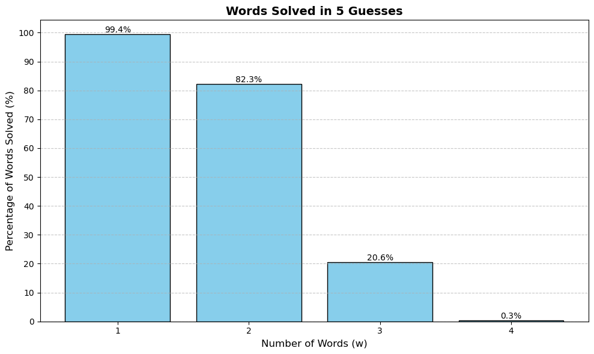

# CS4710-Quordle-CSP

Files in the Quordle Repo:
- **solutions.txt**: txt file containing solution words that program pulls from to make the 4 distinct solutions
- **quordleUI.py**: py file that is an implementation of quordle.  visual representation that can be used to visually show our AI solution
- **startingWords.py**: py file that provides a helper function for the forward checking in the CSP solver
- **cspSolver.py**: py file that contains the Quordle CSP solver, can be run with an aditional inputs arg to simulate _(N)_ games and _(g)_ guesses.

Results with _N_ = 100 and _g_ = 9:

```
python cspSolver 100 9
```

```
Simulating: 100%|███████████████████████████████████████| 100/100 [00:01<00:00, 96.15game/s]
Results: 98/100 games won
```

Other stats:
When Simulating 1000 games:


